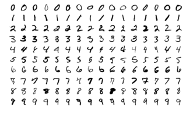

## PyTorch Image Classification Example: MNIST
This repository contains code for a PyTorch image classification example on the MNIST dataset.

### Overview
In this example, we demonstrate how to build and train a deep neural network for image classification using PyTorch on the MNIST dataset. The example includes a Python code that guides you through the process of loading the dataset, building the neural network, training the model, and evaluating its performance.

The neural network architecture used in this example is based on the ResNet18 architecture, a popular convolutional neural network architecture for image classification tasks. We also use the Adam optimizer and cross-entropy loss to train the model.



### Contents
The repository includes the following files:

- `main.py`: A Python code that demonstrates how to build and train a ResNet18-based neural network for image classification on the MNIST dataset using PyTorch.
- `requirements.txt`: A list of Python packages required to run the example.

### Requirements
To run the example, you will need the following:

- Python 3.8+
- PyTorch 2.0+
- NumPy
- Matplotlib
- scikit-learn

### Installation
1. Create a new virtual environment using the following command:

- On Linux or macOS:
```bash
python3 -m venv .venv
```
- On Windows:
```bash
python -m venv .venv
```
2. Activate the virtual environment:

- On Linux or macOS:

  ```bash
  source .venv/bin/activate
  ```

- On Windows:

  ```bash
  .venv\Scripts\activate.bat
  ```

3. Upgrade `pip` to the latest version:


```bash
pip install --upgrade pip
```

4. Install the dependencies listed in the `requirements.txt` file:


```bash
pip install -r requirements.txt
```

This will install all the packages and their dependencies listed in the `requirements.txt` file in your virtual environment.

5. You are now ready to run the project! To exit the virtual environment, run the following command:


```bash
deactivate
```

### Getting Started
To get started with the example, simply clone this repository and open the `main.py`. The code includes step-by-step instructions  that demonstrate how to load the dataset, build the neural network, train the model, and evaluate its performance.
### License
This code is provided under the MIT License. See the `LICENSE` file for details.
### Acknowledgments
This example was inspired by the PyTorch tutorials and examples, as well as the scikit-learn machine learning library. Special thanks to these projects and their contributors for making such excellent resources available to the community.
